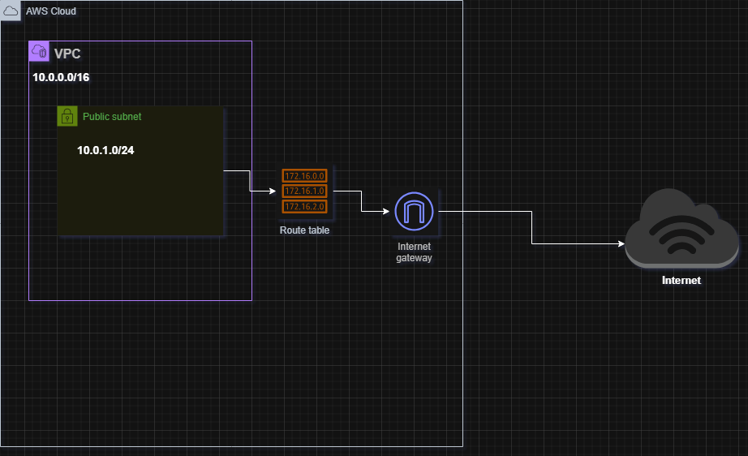

# Building-a-Virtual-Private-Cloud

## 🌐 AWS VPC with Public Subnet and Internet Gateway

## 📘 Project Overview

This project demonstrates how to set up a basic **Virtual Private Cloud (VPC)** in **Amazon Web Services (AWS)**. It includes the creation of a **custom VPC**, a **public subnet**, an **Internet Gateway**, and the necessary **route table configurations** to enable internet access from the public subnet.

This setup is foundational for deploying any application or service on AWS and gives you a strong understanding of networking components in cloud infrastructure.

---

## 🧰 Tools & Services Used

- AWS Management Console
- Amazon VPC
- Subnets
- Internet Gateway (IGW)
- Route Tables

---

## 🧱 Architecture Diagram

> _This setup enables internet access for resources (like EC2 instances) launched in the public subnet._

---

## 📌 Project Objectives

- Create a custom VPC to isolate cloud resources.
- Set up a public subnet within the VPC.
- Attach an Internet Gateway for outbound internet access.
- Update the route table to route internet traffic through the gateway.
- Lay a solid networking foundation for future AWS deployments.

---

## 🛠️ Step-by-Step Implementation Guide

### 1️⃣ Create a Custom VPC

1. Go to the **AWS VPC Dashboard**.
2. Click **"Create VPC"** and select **"VPC only"**.
3. Configure:
   - **Name tag**: `MyVPC`
   - **IPv4 CIDR block**: `10.0.0.0/16`
4. Leave other options as default and create the VPC.

---

### 2️⃣ Create a Public Subnet

1. Navigate to **Subnets > Create subnet**.
2. Select:
   - **VPC ID**: `MyVPC`
   - **Subnet name**: `PublicSubnet`
   - **Availability Zone**: (Choose any zone)
   - **IPv4 CIDR block**: `10.0.1.0/24`
3. Click **Create subnet**.

---

### 3️⃣ Create and Attach an Internet Gateway (IGW)

1. Go to **Internet Gateways > Create internet gateway**.
2. Enter **Name tag**: `MyIGW` and create it.
3. Select the new IGW and click **Actions > Attach to VPC**.
4. Choose `MyVPC`.

---

### 4️⃣ Configure Route Table

1. Go to **Route Tables** and select the one associated with `MyVPC`.
2. Rename it to `PublicRouteTable` (optional but clearer).
3. Under **Routes**, click **Edit routes**.
4. Add a new route:
   - **Destination**: `0.0.0.0/0`
   - **Target**: `Internet Gateway (MyIGW)`
5. Save the changes.

---

### 5️⃣ Associate Subnet with Route Table

1. In the same route table, go to **Subnet associations**.
2. Click **Edit subnet associations**.
3. Select the `PublicSubnet`.
4. Save.

---

## ✅ Result

You now have:

- A custom VPC (`10.0.0.0/16`)
- A public subnet (`10.0.1.0/24`)
- An Internet Gateway for connectivity
- A route table that allows outbound internet traffic

This configuration allows any instance launched in the public subnet (with a public IP) to connect to the internet.

---

---

## 🌟 Key Takeaways

- **VPCs** provide isolated environments in the cloud.
- **Public subnets** are used for resources that need internet access.
- **Internet Gateways** act as a bridge between your VPC and the internet.
- **Route Tables** control network traffic routing within your VPC.

---

## 💼 About Me

This project is part of my **AWS Cloud Infrastructure Portfolio** as a beginner in cloud engineering and DevOps. I am passionate about learning scalable cloud solutions and building secure, efficient infrastructures for modern applications.

📧 Reach me on [LinkedIn](#) | 💼 Hire me for your next AWS project!

---

